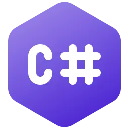

<h2 align="center">
    👋 console.log("Hi!, I’m José Miguel Reyes");
</h2>

<br/>

<p align="justify">
I am an IT Consultant, specialized in the application of Data Analytics and Artificial Intelligence in the automation and productivity increase of Business Processes, as well as in Software Development for the Web, mobile devices and for Windows, Linux and macOS desktops.
</p>

<p align="justify">
I love seeking and finding solutions to problems through technology and I am involved in all phases of the projects I work on, from planning to production, to ensure that the final result is the best possible.
</p>

<p align="justify">
Throughout my professional career I have acquired another set of skills that allow me to help every day all those people who rely on my work, such as Systems Administration, design, implementation and management of IT Infrastructures and Processes or Cybersecurity, among many others.
</p>

<p align="justify">
When I'm not programming or attending consultations, I'm collaborating with the IT Community or learning new things.
</p>

<p align="justify">
Currently, I am fully immersed in the study and analysis of recently emerged Data Science and Artificial Intelligence-based tools and their impact on the effective increase in productivity of IT processes in companies, either through their direct application or through purpose-programmed solutions.
</p>

```javascript
const seyerjo = {
	pronouns: ["he", "him"],
	passions: ["Data Science", "AI", "Web, Mobile and Desktop Development"],
	askMeAbout: ["Software Development", "Data Science", "AI", "IT"],
};
```

<h5 style="text-align: center; color: red;">
    This is my new space on GitHub. I'll gradually be republishing all the projects I share with the community
</h5>

<h2 align="center">
    Some Technologies I have used in my projects ...
</h2>

<br/>

<div align="center">
    
    
    
    
    
    
    
</div>

<div align="center">
    
    
    
    
    
    
    
    
</div>

<div align="center">
    
    
    
    
    
    
    
    
    
    
    
</div>

<div align="center">
    
    
    
    
    
        
    
    
    
    
</div>

<div align="center">
    
    
    
    
    
    
    
    
    
    
</div>

<div align="center">
    
    
    
    
    
    
    
    
</div>

<div align="center">
    
     
    
    
    
    
</div>
