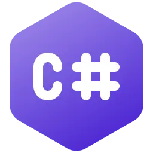

<h2 align="center">
    👋 console.log("Hi!, I’m José Miguel Reyes");
</h2>

<br/>

<blockquote>
Using data analysis, Artificial Intelligence, and software development as a driving force to transform business operations and make them more efficient and productive is at the core of my professional work.
</blockquote>

<p align="justify">
 I am an Information Technology Consultant focused on the strategic application of <span style= "font-weight: bold;">Data Analysis and Artificial Intelligence</span> to automate processes and enhance business productivity. I also develop <span style= "font-weight: bold;">custom software</span> for various platforms (web, mobile an desktop).
</p>

<p align="justify">
My commitment to project success leads me to be <span style= "font-weight: bold;">fully involved in all their phases</span>, from initial conception to deployment. <span style= "font-weight: bold;">This comprehensive perspective</span> of the project lifecycle is grounded in a solid foundation of knowledge and <span style= "font-weight: bold;">over 20 years of experience</span> in areas such as <span style= "font-weight: bold;">Systems Administration</span>, the design, implementation, and management of <span style= "font-weight: bold;">IT Infrastructures</span>, and <span style= "font-weight: bold;">Cybersecurity</span>. This enables me to tackle challenges from a broad perspective and offer more robust and complete solutions.
</p>

<p align="justify">
When I’m not immersed in projects or consulting, <span style= "font-weight: bold;">I dedicate my time to</span> collaborating with the IT Community and, above all, to <span style= "font-weight: bold;">continuous learning</span>. Currently, I am focused on studying and deeply analyzing the <span style= "font-weight: bold;">latest tools in Data Science and Artificial Intelligence</span>, actively researching their real and effective impact on optimizing technological processes in companies, both through direct application and the development of innovative solutions.
</p>

```javascript
const seyerjo = {
	pronouns: ["he", "him"],
	passions: ["Data Science", "AI", "Web, Mobile and Desktop Development"],
	askMeAbout: ["Software Development", "Data Science", "AI", "IT"],
};
```

<h2 align="center">
    ⚙️ Some Technologies I have used in my projects ...
</h2>

<br/>

<div align="center">
    
    
    
    
    
    
    
</div>

<div align="center">
    
    
    
    
    
    
    
    
    
</div>

<div align="center">
    
    
    
    
    
    
    
    
    
    
</div>

<div align="center">
    
    
    
    
    
        
    
    
    
    
</div>

<div align="center">
    
    
    
    
    
    
    
    
    
    
</div>

<div align="center">
    
    
    
    
    
    
    
    
</div>

<div align="center">
    
        
     
     
    
    
    
    
</div>

<div align="center">
    
    
    
    
    
    
    
    
</div>

<hr style="border: none; height: 1px; margin: 20px 0;">

<h3 align="center">📌This is my new space on GitHub.</h3>
<p align="center">I'll gradually be republishing all the projects I share with the community.</p>

<hr style="border: none; height: 1px; margin: 20px 0;">
